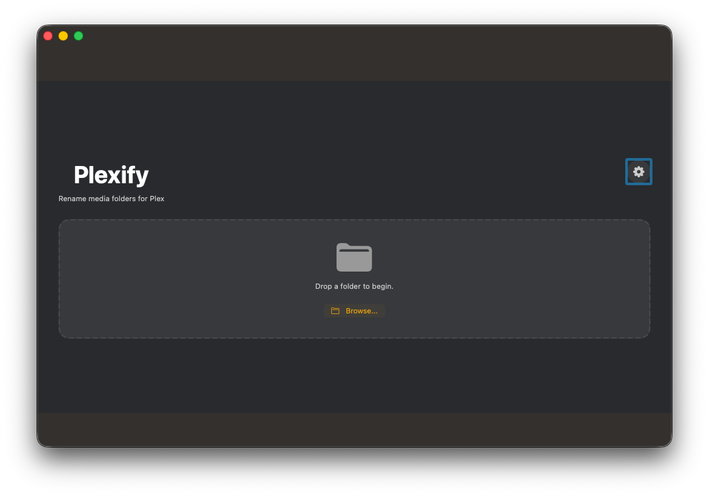

# Plexify

A macOS app that automatically renames media folders and files to follow Plex-optimized naming conventions, including IMDb IDs and optional edition tags.

## Features

- 🎬 **Movie Support**: Rename movie folders with IMDb IDs and optional edition tags
- 📺 **TV Show Support**: Organize TV shows with season folders and episode naming
- 🔍 **IMDb Lookup**: Automatic IMDb ID lookup via TMDb API with local caching
- ✏️ **Manual Override**: Manually enter IMDb IDs when needed
- 🎨 **Dark Plex Theme**: Beautiful dark UI inspired by Plex
- 🔄 **Safe Renaming**: Preview changes before applying, with automatic rollback on errors
- 📋 **Smart Detection**: Automatically detects movies vs TV shows and excludes extras/featurettes

## Screenshots



## Requirements

- macOS 13.0 (Ventura) or later
- TMDb API key (free at [themoviedb.org](https://www.themoviedb.org/))

## Installation

1. Download the latest `Plexify.app` from the Releases page.
2. Drag it to your `/Applications` folder.
3. Right-click > Open on first launch (Gatekeeper).

## TMDb API Key

Plexify uses TMDb to look up IMDb IDs.

1. Sign up at [themoviedb.org](https://www.themoviedb.org/)
2. Go to Settings > API
3. Request an API key (free)
4. Open Plexify Settings (gear icon) and paste the key

The key is stored securely in your Keychain.

## Usage

1. **Launch Plexify**
2. **Drag and drop** a media folder or a single media file onto the drop zone
3. **Review** the rename preview (folder name, files, warnings)
4. **Edit IMDb ID** if needed (optional)
5. **Click "Apply Rename"** to execute the changes

### Supported Naming Patterns

#### Movies
- **Basic**: `MovieName (Year) {imdb-ttXXXXXXX}`
- **With Edition**: `MovieName (Year) {edition-Director's Cut} {imdb-ttXXXXXXX}`
- Example: `The Matrix (1999) {imdb-tt0133093}`

#### TV Shows
- **Season-Based**: `ShowName (Year) {imdb-ttXXXXXXX}/Season 01/ShowName (Year) - s01e01 - Episode Title.ext`
- **Date-Based**: `ShowName (Year) - YYYY-MM-DD - Episode Title.ext`
- Example: `Band of Brothers (2001) {imdb-tt0185906}/Season 01/Band of Brothers (2001) - s01e01 - Currahee.mkv`

For detailed naming rules, see [rules.md](rules.md). For supported patterns and limitations, see [requirements.md](requirements.md).

## Project Structure

```
Plexify/
├── Plexify/
│   ├── Models/          # Data models (MediaItem, Episode, RenamePlan)
│   ├── Services/        # Business logic (FolderRenamer, FolderScanner, ImdbLookupClient)
│   ├── ViewModels/      # App state management (PlexifyViewModel)
│   ├── Views/           # UI components (PreviewView, ProgressView)
│   ├── Utilities/       # Helpers (PathSanitizer, PlexColors)
│   └── DragDrop/        # Drop zone component
├── PlexifyTests/        # Unit tests
└── PlexifyUITests/      # UI tests
```

## Configuration

### TMDb API Key

Plexify uses TMDb (The Movie Database) to look up IMDb IDs. You need a free API key:

1. Sign up at [themoviedb.org](https://www.themoviedb.org/)
2. Go to Settings > API
3. Request an API key (free)
4. Open Plexify Settings and paste the API key (stored securely in Keychain)
5. (Optional) Add it as an environment variable for local dev (see Quick Start above)

The API key is only used for IMDb lookups and is never stored or transmitted except to TMDb's servers.

### Cache Location

IMDb lookup results are cached locally at:
```
~/Library/Application Support/Plexify/imdb_cache.json
```

You can delete this file to clear the cache.

## Testing

Run unit tests:
```bash
xcodebuild -scheme Plexify test
```

Or in Xcode: `Cmd+U`

### Test Coverage

- ✅ Naming rules (movies and TV shows)
- ✅ Path sanitization
- ✅ Folder scanning and classification
- ✅ IMDb lookup (stub and cache)
- ✅ Rename plan building
- ✅ Rollback functionality

## Packaging & Distribution

### Building for Distribution

1. **Archive the app**
   ```bash
   xcodebuild -scheme Plexify -configuration Release archive \
     -archivePath ./build/Plexify.xcarchive
   ```

2. **Export the app**
   ```bash
   xcodebuild -exportArchive \
     -archivePath ./build/Plexify.xcarchive \
     -exportPath ./build/export \
     -exportOptionsPlist ExportOptions.plist
   ```

### Code Signing

For distribution outside the Mac App Store:

1. **Developer ID Certificate**: Required for notarization
2. **App-specific password**: For notarization with Apple
3. **Hardened Runtime**: Enabled in build settings
4. **Entitlements**: Configured for file access

**Note**: For personal use, you can build and run without signing. For distribution, you'll need:
- Apple Developer account ($99/year)
- Code signing certificate
- Notarization (required for macOS Gatekeeper)

### Creating a DMG (Optional)

```bash
# Create DMG with create-dmg (install via Homebrew: brew install create-dmg)
create-dmg \
  --volname "Plexify" \
  --window-pos 200 120 \
  --window-size 600 300 \
  --icon-size 100 \
  --icon "Plexify.app" 175 120 \
  --hide-extension "Plexify.app" \
  --app-drop-link 425 120 \
  "Plexify.dmg" \
  "./build/export/Plexify.app"
```

## Development

### Adding New Features

- **UI Components**: Add to `Plexify/Views/`
- **Business Logic**: Add to `Plexify/Services/`
- **Models**: Add to `Plexify/Models/`
- **Tests**: Add to `PlexifyTests/`

### Code Style

- Follow Swift API Design Guidelines
- Use `PascalCase` for types, `camelCase` for variables/functions
- Keep files focused and small
- Write tests for new functionality

## Limitations

- **macOS Only**: Windows and Linux are not supported
- **Single Folder**: Processes one folder at a time
- **No Episode Parsing**: TV shows require manual episode data (future enhancement)
- **TMDb Dependency**: Requires internet connection for IMDb lookups (cached locally)

## Troubleshooting

### "Missing API Key" Error
- Ensure `TMDB_API_KEY` is set in your Xcode scheme's environment variables
- Restart Xcode after adding the environment variable

### "No media files found"
- Ensure the folder contains video files (mp4, mkv, avi, etc.)
- Check that files aren't in excluded folders (Featurettes, Extras, etc.)

### Rename Fails
- Check file permissions
- Ensure no other apps are using the files
- The app will automatically rollback on failure

## Contributing

Contributions are welcome! Please:
1. Fork the repository
2. Create a feature branch
3. Make your changes
4. Add tests
5. Submit a pull request

## License

*License information to be added*

## Acknowledgments

- [Plex](https://www.plex.tv/) for naming conventions
- [TMDb](https://www.themoviedb.org/) for movie/TV metadata API
- [IMDb](https://www.imdb.com/) for movie/TV show identifiers

## Related Documentation

- [Requirements](requirements.md) - Supported patterns and out-of-scope items
- [Rules](rules.md) - Naming rules and token definitions
- [Project Plan](PROJECT_PLAN.md) - Development roadmap
